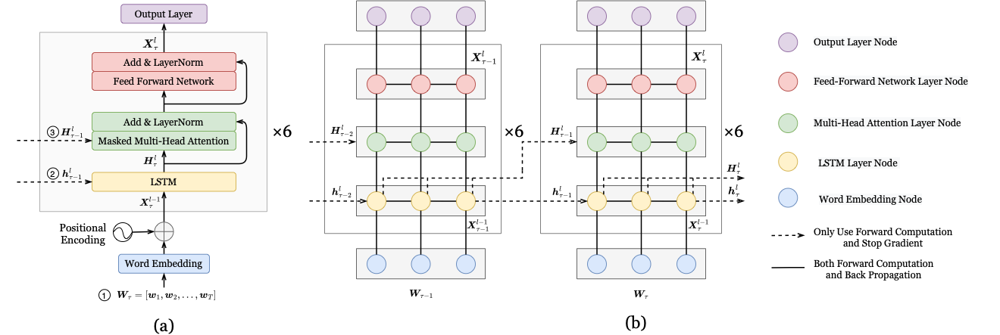

# CrossUttLMs

## Introduction:

Language models have been conventionally evaluated on the sentence level, which derives from the typical decoding procedure
which is carried out for each utterance independently. The utterance assumed to be a sentence is a natural unit for parallel decoding in an off-line speech recognition scenario.

Practically, multiple consecutive utterances can be part of the same discourse, which are potentially related to each other. In recent years, performance improvements have been reported by using neural network language models that can represent longer span history contexts across a range of ASR tasks. To this end, it is natural to consider language modeling with more powerful and robust cross-utterance representations.

The code is based on the Kaldi recipe and mainly implemented using PyTorch. A single GPU card is used for training. The detailed configurations and the training process for Cross-Utterance LMs are presented as follows

## Prerequisite:

Please run the following command and install the packages.
```shell
 pip install -r requirements.txt
```

## Implementation:

### Baseline Language Model Settings

<div align=center>

</div>

Examples of (a) a LSTM-Transformer architecture based LM with 6 repeated blocks in segment-wise where ① is the concatenation of the word embedding with T input words from the history utterances; ② and ③ denotes the information flow of the hidden states of the past segment $\tau-1$ sent to LSTM module and Multi-head Attention layer respectively. (b) An illustration of the information flow of LSTM-Transformer LM with the length T=3. In time stamp $\tau$, the LSTM is initialized by the final hidden states of the past segment $\boldsymbol h_{\tau-1}^l$. The hidden states $\boldsymbol H_{\tau-1}^l$ are sent for attention calculation. Solid line represent the forward calculation and back propagation. Dashed arrows represent only use forward calculation and stop gradient.

</br>

|             | embedding_dim | hidden_dim | nlayers | learning_rate   | dropout  |
| ----------- | ------------- | ---------- | ------- | --------------- | -------- |
| LSTM        | 1024          | 1024       | 2       | 5               | 0.2      |
| Transformer | 512           | 4096       | 6       | 0.1             | 0.2      |

### Neural Language Model Training Steps

```shell
 # level: using word-level or bpe-level data set.
 # stage: 0 - Data preparation; 1 - LM training; 2 - PPL evaluation; 3 - N-best rescoring.

 # Train a baseline Transformer LM in word-level:
 bash local/pytorchnn/run_nnlm_trans_swbd.sh --stage 1 --gpu 1 --level word

 # Train a baseline LSTM LM in bpe-level:
 bash local/pytorchnn/run_nnlm_lstm_swbd.sh --stage 1 --gpu 2 --level bpe
```
